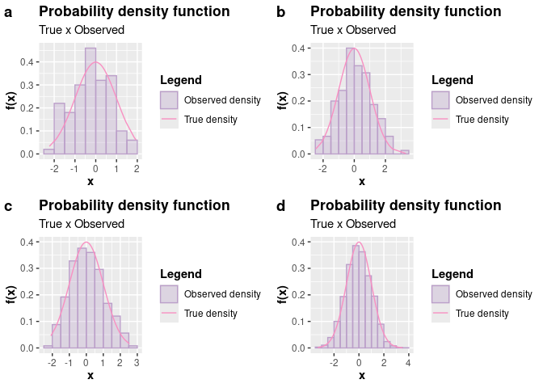

<!-- README.md is generated from README.Rmd. Please edit that file -->

# AcceptReject 

[](https://cran.r-project.org/package=AcceptReject)
[](https://github.com/prdm0/AcceptReject/actions/workflows/R-CMD-check.yaml)
[](https://prdm0.r-universe.dev)
[](https://www.gnu.org/licenses/gpl-3.0.en.html)
[](https://cran.r-project.org/package=AcceptReject)

Generating pseudo-random observations from a probability distribution is
a common task in statistics. Being able to generate pseudo-random
observations from a probability distribution is useful for simulating
scenarios, in
[Monte-Carlo](https://en.wikipedia.org/wiki/Monte_Carlo_method) methods,
which are useful for evaluating various statistical models.

The inversion method is a common way to do this, but it is not always
possible to find a closed-form formula for the inverse function of the
cumulative distribution function of a random variable $X$, that is,
$q(u) = F^{-1}(u) = x$ (quantile function), where $F$ is the cumulative
distribution function of $X$ and $u$ is a uniformly distributed random
variable in the interval $(0, 1)$.

Whenever possible, it is preferable to use the inversion method to
generate pseudo-random observations from a probability distribution.
However, when it is not possible to find a closed-form formula for the
inverse function of the cumulative distribution function of a random
variable, it is necessary to resort to other methods. One way to do this
is through the [acceptance-rejection
method](https://en.wikipedia.org/wiki/Rejection_sampling), which is a
Monte-Carlo procedure. This package aims to provide a function that
implements the Acceptance and Rejection method for generating
pseudo-random observations from probability distributions that are
difficult to sample directly.

The package [AcceptReject](https://github.com/prdm0/AcceptReject)
provides the `AcceptReject::accept_reject()` function that implements
the acceptance-rejection method in an optimized manner to generate
pseudo-random observations for discrete or continuous random variables.
The `AcceptReject::accept_reject()` function operates in parallel on
Unix-based operating systems such as Linux and MacOS and operates
sequentially on Windows-based operating systems; however, it still
exhibits good performance. By default, on Unix-based systems,
observations are generated sequentially, but it is possible to generate
observations in parallel if desired, by using the `parallel = TRUE`
argument.

The `AcceptReject::accept_reject()` function, by default, attempts to
maximize the probability of acceptance of the pseudo-random observations
generated. Suppose $X$ and $Y$ are random variables with probability
density function (pdf) or probability function (pf) $f$ and $g$,
respectively. Furthermore, suppose there exists a constant $c$ such that

$$\frac{f_X(x)}{g_Y(y)} \leq c.$$

By default, the accept_reject function attempts to find the value of $c$
that maximizes the probability of acceptance of the pseudo-random
observations generated. However, it is possible to provide a value of
$c$ to the `AcceptReject::accept_reject()` function through the argument
`c`, where $Y$ is a random variable for which we know how to generate
observations. For the `AcceptReject::accept_reject()` function, it is
not necessary to specify the probability function or probability density
function of $Y$ to generate observations of $X$ for discrete and
continuous cases, respectively. For the discrete and continuous cases,
$Y$ follows the discrete uniform distribution function and continuous
uniform distribution function, respectively.

Since the probability of acceptance is $1/c$, the
`AcceptReject::accept_reject()` function attempts to find the minimum
value of $c$ that satisfies the description above. Unless you have
compelling reasons to provide a value for the `c` argument of the
`AcceptReject::accept_reject()` function, it is recommended to use
`c = NULL` (default), allowing a value of $c$ to be automatically
determined.

## Installation

The package is being versioned on GitHub. You can install the
development version of
[AcceptReject](https://github.com/prdm0/AcceptReject), and to do this,
you must first install the
[remotes](https://CRAN.R-project.org/package=remotes) package and then
run the following command:

``` r
# install.packages("remotes")
# or remotes::install_github("prdm0/AcceptReject", force = TRUE)
library(AcceptReject)
```

The `force = TRUE` argument is not necessary. It is only needed in
situations where you have already installed the package and want to
reinstall it to have a new version.

## Examples

Please note the examples below on how to use the
`AcceptReject::accept_reject()` function to generate pseudo-random
observations of discrete and continuous random variables. For further
details, refer to the function’s documentation
[**Reference**](https://prdm0.github.io/AcceptReject/reference/) and the
[**Vignette**](https://prdm0.github.io/AcceptReject/articles/accept_reject.html).

### Generating discrete observations

As an example, let $X \sim Poisson(\lambda = 0.7)$. We will generate
$n = 1000$ observations of $X$ using the acceptance-rejection method,
using the `AcceptReject::accept_reject()` function. Note that it is
necessary to provide the `xlim` argument. Try to set an upper limit
value for which the probability of $X$ assuming that value is zero or
very close to zero. In this case, we choose `xlim = c(0, 20)`, where
`dpois(x = 20, lambda = 0.7)` is very close to zero (1.6286586^{-22}).

``` r
library(AcceptReject)
library(cowplot) # install.packages("cowplot")
# Ensuring Reproducibility
set.seed(0) 

simulation <- function(n){
  AcceptReject::accept_reject(
    n = n,
    f = dpois,
    continuous = FALSE,
    args_f = list(lambda = 0.7),
    xlim = c(0, 20),
    parallel = TRUE
  )
}

a <- plot(simulation(25L))
b <- plot(simulation(250L))
c <- plot(simulation(2500L))
d <- plot(simulation(25000L))

plot_grid(a, b, c, d, nrow = 2L, labels = c("a", "b", "c", "d"))
```


## Generating continuous observations

To expand beyond examples of generating pseudo-random observations of
discrete random variables, consider now that we want to generate
observations from a random variable
$X \sim \mathcal{N}(\mu = 0, \sigma^2 = 1)$. We chose the normal
distribution because we are familiar with its form, but you can choose
another distribution if desired. Below, we will generate `n = 2000`
observations using the acceptance-rejection method. Note that
`continuous = TRUE`.

``` r
library(AcceptReject)
library(cowplot) # install.packages("cowplot")

# Ensuring reproducibility
set.seed(0) 

simulation <- function(n){
  AcceptReject::accept_reject(
    n = n,
    f = dnorm,
    continuous = TRUE,
    args_f = list(mean = 0, sd = 1),
    xlim = c(-4, 4),
    parallel = TRUE
  )
}
# Inspecting
a <- plot(simulation(n = 250L))
b <- plot(simulation(n = 2500L))
c <- plot(simulation(n = 25000L))
d <- plot(simulation(n = 250000L))

plot_grid(a, b, c, d, nrow = 2L, labels = c("a", "b", "c", "d"))
```


The
[`accept_reject()`](https://prdm0.github.io/AcceptReject/reference/accept_reject.html)
function supports, **for the continuous case**, specifying a base
probability density function if you don’t want to use the continuous
uniform distribution as the default base.

When choosing to specify another probability density function different
from the uniform one, it’s necessary to specify the following arguments:

- `f_base`: base probability density function;
- `random_base`: sampling from the base probability density function;
- `args_f_base`: list with the parameters of the base density.

By default, all of them are `NULL`, and the continuous uniform
distribution in `xlim` is used as the base. If at least one of these
arguments is not specified, no error will occur, and the continuous
uniform distribution in `xlim` will still be used as the base.

For the discrete case, if the user mistakenly specifies any of these
arguments, i.e., when `continuous = FALSE`, the
[`accept_reject()`](https://prdm0.github.io/AcceptReject/reference/accept_reject.html)
function will ignore these arguments and use the discrete uniform
distribution as the base.

If you choose to specify a base density, it’s convenient to inspect it
by comparing the base density function with the theoretical probability
density function. The
[`inspect()`](https://prdm0.github.io/AcceptReject/reference/accept_reject.html)
function facilitates this task. The
[`inspect()`](https://prdm0.github.io/AcceptReject/reference/accept_reject.html)
function will plot the base probability density function and the
theoretical probability density function, find the intersection between
the densities, and display the value of the intersection area on the
plot. These are important pieces of information to decide if the base
probability density function specified in the `args_f_base` argument and
the value of `c` (default is 1) are appropriate.

## Example of inspection

``` r
library(AcceptReject)
library(cowplot) # install.packages("cowplot")

# Ensuring reproducibility
set.seed(0)

# Inspecting
# Case a
a <- inspect(
  f = dweibull,
  args_f = list(shape = 2.1, scale = 2.2),
  f_base = dgamma,
  args_f_base = list(shape = 2.8, rate = 1.2),
  xlim = c(0, 10),
  c = 1.2
)

# Inspecting
# Case b
b <- inspect(
  f = dweibull,
  args_f = list(shape = 2.1, scale = 2.2),
  f_base = dgamma,
  args_f_base = list(shape = 2.9, rate = 2.5),
  xlim = c(0, 10),
  c = 1.4
)

plot_grid(a, b, nrow = 2L, labels = c("a", "b"))
```



Notice that considering the distribution in scenario “a” in the code
above is more convenient. Note that the area is approximately 1, the
base probability density function with parameters `shape = 2.8` and
`rate = 1.2` provides a shape close to the theoretical distribution, and
`c = 1.2` ensures that the base density function upper bounds the
theoretical probability density function. Therefore, considering
`f_base` with $\Gamma(\alpha = 2.8, \beta = 1.2)$ and `c = 1.2` is a
reasonable choice for a base distribution.

Therefore, passing arguments to `f_base = dgamma`,
`args_f_base = list(shape = 2.8, rate = 1.2)`, and `c = 1.2` to the
[`accept_reject()`](https://prdm0.github.io/AcceptReject/reference/accept_reject.html)
function will lead us to an even more efficient code.

``` r
library(AcceptReject)
library(tictoc) # install.packages("tictoc")

# Ensuring reproducibility
set.seed(0)

# Não especificando a função densidade de probabilidade base

tic()
case_1 <- accept_reject(
  n = 200e3L,
  continuous = TRUE,
  f = dweibull,
  args_f = list(shape = 2.1, scale = 2.2),
  xlim = c(0, 10)
)
toc()
#> 0.385 sec elapsed

# Specifying the base probability density function
tic()
case_2 <- accept_reject(
  n = 200e3L,
  continuous = TRUE,
  f = dweibull,
  args_f = list(shape = 2.1, scale = 2.2),
  f_base = dgamma,
  random_base = rgamma,
  args_f_base = list(shape = 2.8, rate = 1.2),
  xlim = c(0, 10),
  c = 1.2
)
toc()
#> 0.151 sec elapsed

# Visualizing the results
p1 <- plot(case_1)
p2 <- plot(case_2)

plot_grid(p1, p2, nrow = 2L)
```


Notice that the results were very close in a graphical analysis.
However, the execution time specifying a convenient base density was
lower for a very large sample.
